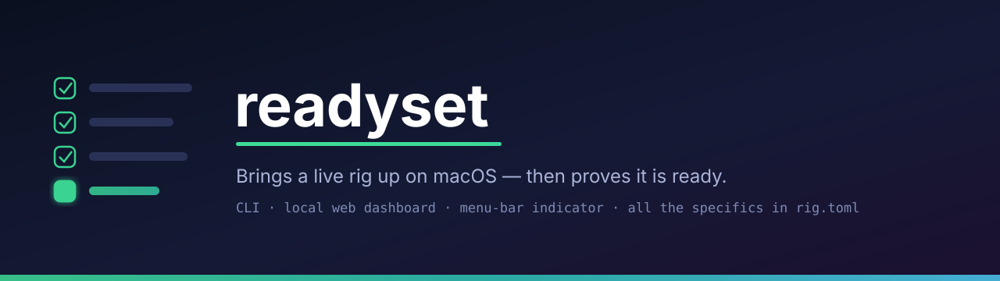

<p align="center"></p>

# readyset

**A macOS application that brings a live rig up — the physical installation, its
keyboards, its cables, its DAW, its control surfaces — and then proves it is
ready. Three surfaces: a command line, a local web dashboard, and a menu-bar
indicator that turns red before you do.**

```bash
readyset preflight     # bring everything up, then verify it
readyset check         # verify only — no launching, no side effects
readyset monitor       # keep watching while you work, and shout when it breaks
readyset serve         # the web dashboard, on http://127.0.0.1:8765
```

Built for a live keyboard rig — the example config is one — but the engine names
no product. Everything specific to *your* installation lives in `rig.toml`.

---

## The problem it solves

A setup that depends on eight applications, four MIDI devices, a network host and
a VPN has no single place that says *yes, you are ready*. You find out you are
not — on stage, mid-song, when a keyboard answers nothing.

The usual answer is a checklist you run by hand and stop running after a month.
`readyset` is that checklist as a file, run by a machine, before it matters.

## The three surfaces

| | |
|---|---|
| **CLI** — `bin/readyset` | `preflight`, `check`, `monitor`, `tidy`, `apps`, `vpn`, `alert-test`, `serve`. Exit codes: `0` all-ok, `1` warnings only, `2` a required check failed — so it composes with anything. |
| **Web dashboard** — `readyset serve` | The same checks as a page on `127.0.0.1:8765`, refreshed while you work, with one-click repairs (relaunch an app, cut the VPN, tidy the windows). Readable from a phone on the same network if you open `[server].host`. |
| **Menu bar** — `readyset/surfaces/menubar` | A small Swift app polling the dashboard. It is the surface you actually look at: green or red, at a glance, without leaving the DAW. Optional — everything works without it. |

Alerts go out on top of that: macOS notifications, an ntfy push, and a MIDI CC on
a dead-end port so a control surface can show the count on a key.

## What it checks

Twenty families of check, run in a fixed order — the runner is
[`readyset/checks/run.py`](readyset/checks/run.py), and that file is the list.
Each family expands to one line per declared application, port or device, so a
real rig shows thirty-odd lines.

None of them names a product: your `rig.toml` does. The right-hand column is the
key that drives the check — if it is absent from your config, the check falls
back to the template value in
[`readyset/core/config.py`](readyset/core/config.py) or reports nothing at all.

| Check | What it verifies | Driven by |
|---|---|---|
| Applications | each declared process is actually running, matched on its full command line | `[checks.apps]` — label → regex |
| Stream Decks | the control surfaces are on the USB bus, by their product name | `[checks].streamdecks` |
| MIDI ports | the input ports that must exist, by substring | `[checks].midi_required` |
| Keyboard | the main keyboard's port is there — an accepted list and a merely-tolerated one | `[modes.*].keyboard_ok` · `keyboard_warn` |
| Breath controller | the breath controller's MIDI input | `[checks].breath_port` · `[modes.*].breath_severity` |
| Stage network | the Mac holds an IP on the stage subnet and the modem answers | `[checks].stage_network` · `modem_host` · `studio_router` |
| Lamps | the stage lamps answer | `[checks].lamps` · `lamp_severity` |
| iPhone link | an established TCP connection on Bome Network's port = a remote is joined | `[checks].bome_network_port` · `iphone_host` |
| VPN | no tunnel is rewriting the routing behind your back | `[checks].vpn.ignore` · `vpn.off_cmds` |
| Accessibility permission | macOS has granted the service the right to *repair* — without it half the one-click fixes lie | *(no key — always on)* |
| Unwanted apps | what is open that the rig does not need | `[checks].unexpected_apps.allow` · `[modes.*].unexpected_apps_severity` |
| Mac power | on mains, not quietly on battery | `[modes.*].mac_power_severity` |
| iPhone charge | the phone is charging — and the battery's own slope to contradict the claim | `[server].phone_stale_seconds` · `trend_*` · `autonomy_min_hours` |
| Anti-sleep | a keep-awake session is running | `[modes.*].require_amphetamine` |
| Audio service | `coreaudiod` is alive — first in the audio block, because when it is down it *is* the cause of the rest | *(no key — always on)* |
| Default output | the system output is where it should be | `[checks].default_output_match` |
| Audio interface | the right interface, present and selected | `[checks].audio_interface` · `[modes.*].interface_severity` |
| Audio devices | any additional device you want watched, one block each | `[[checks.audio_devices]]` |
| DAW output | the DAW plays through the right device | `[modes.*].live_output` |
| DAW window | no modal dialog is sitting in front of the set | `[set].ableton_app` |

Two things shape how that table is *read* rather than what it tests:

- **`[[depends]]` — knock-on failures.** Declare what powers what, and a hub coming
  unplugged shows as one cause with its consequences filed underneath, instead of
  four equally urgent red lines of which three are symptoms
  ([`readyset/core/cascade.py`](readyset/core/cascade.py)).
- **One manual acknowledgement.** The iPhone-charge line is the only thing the Mac
  cannot settle on its own; the dashboard lets you assert it by hand (`/api/manual`).

## Modes

One installation is several installations. A rehearsal is not a gig, and a gig at
home is not one in a venue. `readyset` ships two modes — **`live`** and
**`studio`** — declared in `[modes.live]` and `[modes.studio]`, which set the
severity of each check and the device names expected in each.

`[mode].default = "auto"` resolves them by itself: if `[checks].studio_router` is
reachable, you are at the desk, so a missing breath controller is a remark; if it
is not, you are out, and the same absence is a failure. `--mode live|studio|auto`
on the CLI and the dashboard's slider both force it.

## Configuration

Everything lives in `rig.toml` at the repo root, looked up in this order:
`$RIG_CONF`, then `rig.toml`, then the committed `rig.example.toml`. Whatever is
found is deep-merged over the defaults, so a partial file only overrides what
differs. Python 3.11+ reads TOML natively — no dependency.

```toml
[checks.apps]                       # label -> regex matched against the command line
"My DAW"  = "MyDAW.app/Contents/MacOS/MyDAW"
"My Host" = "MyMidiHost"

[checks]
midi_required   = ["Main Bus"]      # input ports that must exist (substring)
audio_interface = "USB Audio"
streamdecks     = { XL = "Stream Deck XL" }

[launch]
apps = ["/Applications/MyDAW.app"]  # what preflight brings up, in order
```

Start from [`rig.example.toml`](rig.example.toml) — a real rig described in full,
comment by comment — and delete what is not yours. A key the engine does not read
is **said out loud** on startup rather than silently ignored: a typo in a closed
section once made the dashboard launch a second copy of the DAW next to the one
already running, which is why `unknown_keys()` exists.

The code never mentions an application, a serial number or a hostname. Hardware
that needs a picture lives in `readyset/devices/devices.toml`, as data. If you
ever find one of those in the source instead, that is a bug.

## Where this code comes from

`readyset` used to be the **downstream** half of a pair. Upstream was a private
repository holding one real installation: its serial numbers, its service agents,
its file paths, its venues. Everything was born there, on hardware that had to
work, and moved here once it had proved itself over several outings **and** turned
out to name no product.

The split was made on 2026-08-18, after the generic and the specific had grown
about 2800 lines apart inside a single codebase. It was undone on 2026-09-20: two
repositories with one author meant every change had to be made twice, and the
halves drifted anyway. There is now one codebase — this one — and the
configuration of the author's own installation lives on its own, with no code, in
a private repository.

What the split bought is kept as a rule rather than as a repository: **nothing
machine-specific is written in the code.**

## Requirements

macOS, Python 3.11+. `mido` for the MIDI checks; standard library otherwise. The
menu-bar app is Swift and optional — everything works without it.

## Licence

MIT.
